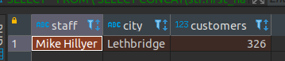
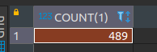
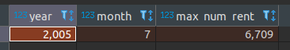
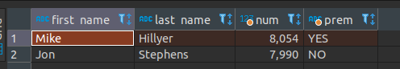
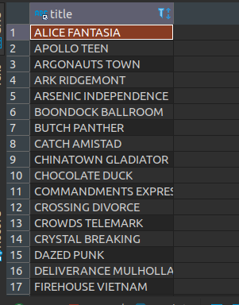

# Домашнее задание к занятию "12.3 "Реляционные базы данных: SQL. Часть 1" - Рыжиков Вячеслав


### Инструкция по выполнению домашнего задания

   1. Сделайте `fork` данного репозитория к себе в Github и переименуйте его по названию или номеру занятия, например, https://github.com/имя-вашего-репозитория/git-hw или  https://github.com/имя-вашего-репозитория/7-1-ansible-hw).
   2. Выполните клонирование данного репозитория к себе на ПК с помощью команды `git clone`.
   3. Выполните домашнее задание и заполните у себя локально этот файл README.md:
      - впишите вверху название занятия и вашу фамилию и имя
      - в каждом задании добавьте решение в требуемом виде (текст/код/скриншоты/ссылка)
      - для корректного добавления скриншотов воспользуйтесь [инструкцией "Как вставить скриншот в шаблон с решением](https://github.com/netology-code/sys-pattern-homework/blob/main/screen-instruction.md)
      - при оформлении используйте возможности языка разметки md (коротко об этом можно посмотреть в [инструкции  по MarkDown](https://github.com/netology-code/sys-pattern-homework/blob/main/md-instruction.md))
   4. После завершения работы над домашним заданием сделайте коммит (`git commit -m "comment"`) и отправьте его на Github (`git push origin`);
   5. Для проверки домашнего задания преподавателем в личном кабинете прикрепите и отправьте ссылку на решение в виде md-файла в вашем Github.
   6. Любые вопросы по выполнению заданий спрашивайте в чате учебной группы и/или в разделе “Вопросы по заданию” в личном кабинете.
   
Желаем успехов в выполнении домашнего задания!
   
### Дополнительные материалы, которые могут быть полезны для выполнения задания

1. [Руководство по оформлению Markdown файлов](https://gist.github.com/Jekins/2bf2d0638163f1294637#Code)

---

### Задание 1

```sql
SELECT
	*
FROM
	(
	SELECT
		CONCAT(stf.first_name , " ",
		stf.last_name) staff
	FROM
		sakila.staff stf
	WHERE
		stf.store_id = (
		SELECT
			cst.store_id
		FROM
			sakila.customer cst
		GROUP BY
			cst.store_id
		HAVING
			COUNT(1)>300)) staff
JOIN 
(
	SELECT
		c2.city
	FROM
		sakila.store str
	JOIN sakila.address a ON
		a.address_id = str.address_id
	JOIN sakila.city c2 ON
		a.city_id = c2.city_id
	WHERE
		str.store_id = (
		SELECT
			c.store_id
		FROM
			sakila.customer c
		GROUP BY
			store_id
		HAVING
			COUNT(1)>300)
) city ON
	1 = 1
JOIN
(
	SELECT
		COUNT(1) customers
	FROM
		sakila.customer cst
	GROUP BY
		cst.store_id
	HAVING
		COUNT(1)>300
) num_cust ON
	1 = 1;
```




---

### Задание 2

```sql
SELECT
	COUNT(1)
FROM
	sakila.film f
WHERE
	f.`length` > (
	SELECT
		AVG( f.`length`)
	FROM
		sakila.film f);
```




************
<ins><span style="color:blue">
SELECT CAST ( p.payment_date  AS DATE ) ddd FROM sakila.payment p; <br> 
SQL Error [1584] [42000]: Incorrect parameters in the call to stored function `CAST` <br> 
CAST Не работает Почему?</span></ins>
************

---

### Задание 3

```sql
SELECT
	num_pay.y 'year',
	num_pay.m 'month',
	max_num_rent.*
FROM
	(
	SELECT
		YEAR(p.payment_date) y,
		month(p.payment_date) m,
		COUNT(1) np
	FROM
		sakila.payment p
	GROUP BY
		y,
		m ) num_pay
JOIN 
(
	SELECT
		COUNT(1) max_num_rent
	FROM
		sakila.rental r
	WHERE
		YEAR(r.rental_date) = (
		SELECT
			num_pay.y
		FROM
			(
			SELECT
				YEAR(p.payment_date) y,
				month(p.payment_date) m,
				COUNT(1) np
			FROM
				sakila.payment p
			GROUP BY
				y,
				m ) num_pay
		WHERE
			num_pay.np = (
			SELECT
				MAX(num_pay.np)
			FROM
				(
				SELECT
					YEAR(p.payment_date) y,
					month(p.payment_date) m,
					COUNT(1) np
				FROM
					sakila.payment p
				GROUP BY
					y,
					m ) num_pay))
		AND 
MONTH (r.rental_date) = (
		SELECT
			num_pay.m
		FROM
			(
			SELECT
				YEAR(p.payment_date) y,
				month(p.payment_date) m,
				COUNT(1) np
			FROM
				sakila.payment p
			GROUP BY
				y,
				m ) num_pay
		WHERE
			num_pay.np = (
			SELECT
				MAX(num_pay.np)
			FROM
				(
				SELECT
					YEAR(p.payment_date) y,
					month(p.payment_date) m,
					COUNT(1) np
				FROM
					sakila.payment p
				GROUP BY
					y,
					m ) num_pay))
) max_num_rent
WHERE
	num_pay.np = (
	SELECT
		MAX(num_pay.np)
	FROM
		(
		SELECT
			YEAR(p.payment_date) y,
			month(p.payment_date) m,
			COUNT(1) np
		FROM
			sakila.payment p
		GROUP BY
			y,
			m ) num_pay);

```



---
## Дополнительные задания (со звездочкой*)


Эти задания дополнительные (не обязательные к выполнению) и никак не повлияют на получение вами зачета по этому домашнему заданию. Вы можете их выполнить, если хотите глубже и/или шире разобраться в материале.


### Задание 4

```sql
SELECT
	s.first_name,
	s.last_name ,
	tab.num,
	CASE
		WHEN tab.num > 8000 THEN 'YES'
		ELSE 'NO'
	END prem
FROM
	(
	SELECT
		p.staff_id ,
		COUNT(1) num
	FROM
		sakila.payment p
	GROUP BY
		p.staff_id) tab
JOIN 
sakila.staff s ON
	s.staff_id = tab.staff_id;
```




### Задание 5


```sql
SELECT
	f.title
FROM
	sakila.film f
WHERE
	f.film_id NOT IN (
	SELECT
		i.film_id
	FROM
		sakila.rental r
	JOIN 
sakila.inventory i ON
		i.inventory_id = r.inventory_id);
```




	
