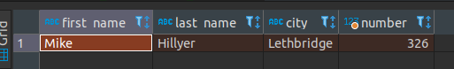
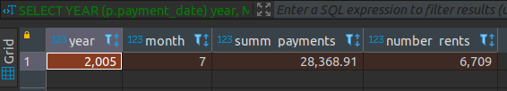

# Домашнее задание к занятию "12.3 "Реляционные базы данных: SQL. Часть 1" - Рыжиков Вячеслав


### Инструкция по выполнению домашнего задания

   1. Сделайте `fork` данного репозитория к себе в Github и переименуйте его по названию или номеру занятия, например, https://github.com/имя-вашего-репозитория/git-hw или  https://github.com/имя-вашего-репозитория/7-1-ansible-hw).
   2. Выполните клонирование данного репозитория к себе на ПК с помощью команды `git clone`.
   3. Выполните домашнее задание и заполните у себя локально этот файл README.md:
      - впишите вверху название занятия и вашу фамилию и имя
      - в каждом задании добавьте решение в требуемом виде (текст/код/скриншоты/ссылка)
      - для корректного добавления скриншотов воспользуйтесь [инструкцией "Как вставить скриншот в шаблон с решением](https://github.com/netology-code/sys-pattern-homework/blob/main/screen-instruction.md)
      - при оформлении используйте возможности языка разметки md (коротко об этом можно посмотреть в [инструкции  по MarkDown](https://github.com/netology-code/sys-pattern-homework/blob/main/md-instruction.md))
   4. После завершения работы над домашним заданием сделайте коммит (`git commit -m "comment"`) и отправьте его на Github (`git push origin`);
   5. Для проверки домашнего задания преподавателем в личном кабинете прикрепите и отправьте ссылку на решение в виде md-файла в вашем Github.
   6. Любые вопросы по выполнению заданий спрашивайте в чате учебной группы и/или в разделе “Вопросы по заданию” в личном кабинете.
   
Желаем успехов в выполнении домашнего задания!
   
### Дополнительные материалы, которые могут быть полезны для выполнения задания

1. [Руководство по оформлению Markdown файлов](https://gist.github.com/Jekins/2bf2d0638163f1294637#Code)

---

### Задание 1

```sql
.SELECT
	s2.first_name ,
	s2.last_name ,
	c2.city ,
	COUNT(1) number
FROM 
	customer c
JOIN
	store s ON
	s.store_id = c.store_id
JOIN  
	staff s2 ON
	s2.staff_id = s.manager_staff_id
JOIN 
	address a ON
	a.address_id = s.address_id
JOIN city c2 ON
	a.city_id = c2.city_id
GROUP BY
	c.store_id
HAVING
	number>300;
```




---

### Задание 2

```sql
SELECT
	COUNT(1)
FROM
	sakila.film f
WHERE
	f.`length` > (
	SELECT
		AVG( f.`length`)
	FROM
		sakila.film f);
```


---

### Задание 3

```sql
SELECT
	YEAR (p.payment_date) year,
	MONTH (p.payment_date) month,
	SUM(p.amount) summ_payments,
	COUNT(1) number_rents
FROM
	payment p
JOIN rental r ON
	p.rental_id = r.rental_id
GROUP BY
	year,
	month
ORDER BY
	summ_payments DESC LIMIT 1;
```



---
## Дополнительные задания (со звездочкой*)


Эти задания дополнительные (не обязательные к выполнению) и никак не повлияют на получение вами зачета по этому домашнему заданию. Вы можете их выполнить, если хотите глубже и/или шире разобраться в материале.


### Задание 4

```sql
SELECT
	s.first_name ,
	s.last_name ,
	COUNT(1) num,
	CASE
		WHEN COUNT(1) > 8000 THEN 'YES'
		ELSE 'NO'
	END prem
FROM
	payment p
JOIN staff s ON
	s.staff_id = p.staff_id
GROUP BY
	p.staff_id ;
```


### Задание 5


```sql
SELECT
	f.title
FROM
	sakila.film f
WHERE
	f.film_id NOT IN (
	SELECT
		i.film_id
	FROM
		sakila.rental r
	JOIN 
sakila.inventory i ON
		i.inventory_id = r.inventory_id);
```


	
